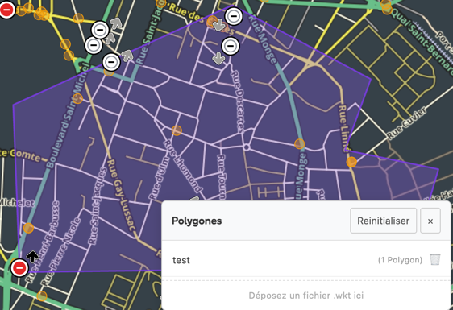
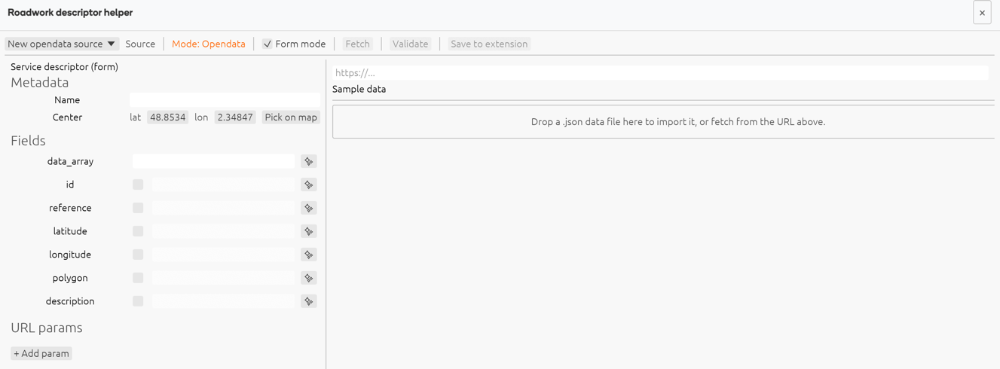
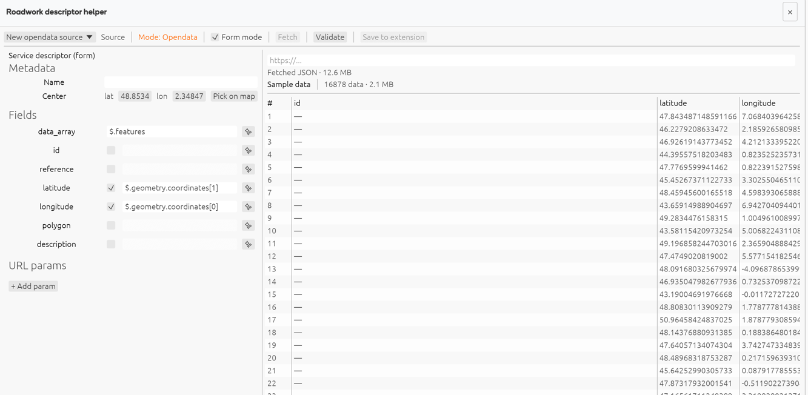
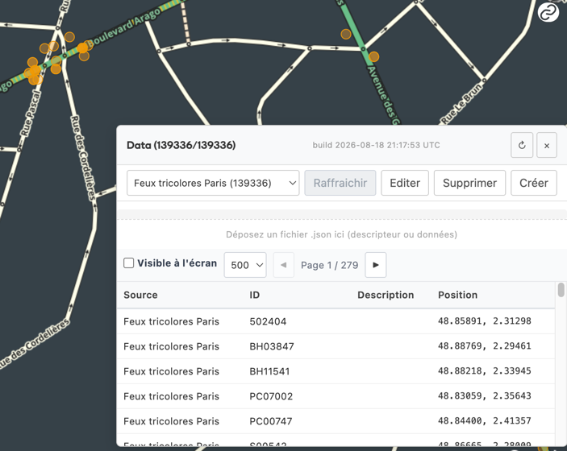

# Roadwork WME Extension

Chrome extension / userscript for **Waze Map Editor (WME)** making it easier to monitor and integrate roadworks from Open Data sources.

## Key Features

The plugin is presented as a toolbar:
.
Click on the button you are interested in to display the corresponding tool.

### Polygons

In the Polygons window, you can drop a WKT (Well-Known Text) file to display custom polygons.

### Data

- You can import any JSON file containing geographic information (traffic lights, level crossings, etc.).
To do this, in the "Data" window, click the "Create" button.
- The import wizard opens.
- 
- Enter a URL or drop a JSON file (or better, a GeoJSON).
- The import wizard then prompts you to select the fields to import.
  - It is essential to specify where the data array (`data_array`), latitude, and longitude are located.
  - Then give the source a name and save.
  - 

The tool will attempt to detect appropriate data fields, and you can adjust them.

Example: traffic lights in Paris

### Roadworks

The plugin can display roadworks on the WME map, sourced from Open Data.
It is possible to manage statuses, for example to mark roadworks as *Processed* or *Ignored*.
Some cities and departments are already supported, others will follow, as well as the ability to extend it yourself.
Status synchronization should be available in a future version.

## Architecture

- **Rust / WebAssembly Engine**
- **SQLite Local Storage (OPFS)**
